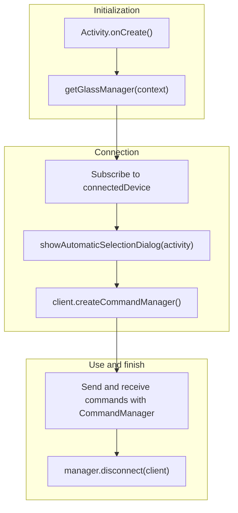

# Getting Started

This guide explains how to build an application that communicates with SABERA glasses using the SABERA App SDK.
The SDK is provided as a native API.

[日本語](getting-started.md) | [English](getting-started_en.md)

## Configure SDK access

The SDK is distributed through GitHub Packages (`jig-SABERA/sabera-sdk-packages`). A Personal Access Token with the
`read:packages` scope is required. See [Creating a GitHub PAT](github-pat_en.md) for instructions.

Add the credentials to `~/.gradle/gradle.properties`:

```properties
GitHubPackagesUsername=<your GitHub username>
GitHubPackagesPassword=<a PAT with read:packages>
```

## Overall flow

This page is written for Android. iOS uses the same API structure, but does not require manifest configuration or runtime
permission requests.



## 1. Manifest and permissions

Add the permissions and the service provided by the SDK to `AndroidManifest.xml`.

```xml
<uses-permission android:name="android.permission.BLUETOOTH_SCAN" />
<uses-permission android:name="android.permission.BLUETOOTH_CONNECT" />
<uses-permission android:name="android.permission.REQUEST_OBSERVE_COMPANION_DEVICE_PRESENCE" />

<service
    android:name="app.jigglass.ble.BleCompanionDeviceService"
    android:exported="true"
    android:permission="android.permission.BIND_COMPANION_DEVICE_SERVICE">
    <intent-filter>
        <action android:name="android.companion.CompanionDeviceService" />
    </intent-filter>
</service>
```

## 2. Connect and open the home page

In `MainActivity.kt`, connect to SABERA and open its home page:

```kotlin
class MainActivity : AppCompatActivity() {
    override fun onCreate(savedInstanceState: Bundle?) {
        super.onCreate(savedInstanceState)

        // Request permission to scan for and connect to Bluetooth devices.
        requestPermissions(
            arrayOf(Manifest.permission.BLUETOOTH_SCAN, Manifest.permission.BLUETOOTH_CONNECT),
            1001,
        )

        // The SDK owns the device-selection dialog, but it needs an Activity to display it.
        SdkActivityHost.showBleDeviceSelectionDialog = { scope, callback ->
            BleDeviceSelector(this).showDialog(scope, singleTarget = false, callback)
        }

        // Automatically connect to the device used last time.
        BleCompanionDeviceService.connectToLastDevice(this)

        val manager = getGlassManager(this)

        // Receive connection and disconnection notifications.
        lifecycleScope.launch {
            manager.connectedDevice.collect { client ->
                if (client == null) return@collect

                // Send Bluetooth commands to the connected SABERA.
                val commandManager = client.createCommandManager()

                // Open the home page.
                commandManager.enterHomePage()
            }
        }

        // Show the device-selection dialog. If a previous device exists, it connects automatically.
        lifecycleScope.launch {
            manager.showAutomaticSelectionDialog(this@MainActivity)
        }
    }

    override fun onDestroy() {
        // Do not leave the destroyed Activity held by the SDK.
        SdkActivityHost.showBleDeviceSelectionDialog = null
        super.onDestroy()
    }
}
```

Notes:

- [`SdkActivityHost.showBleDeviceSelectionDialog`](api/sdk-activity-host/show-ble-device-selection-dialog.md) — Set it once per process and clear it in `onDestroy()`.
- [`showAutomaticSelectionDialog()`](api/glass-manager/show-automatic-selection-dialog.md) — Displays the selection dialog and handles the connection; calling `connect()` separately is unnecessary.
- [`createCommandManager()`](api/glass-client/create-command-manager.md) — Commands are queued internally and sent in order.
- [`enterHomePage()`](api/command-manager/enter-home-page.md) — Changes the page shown on the glasses. Content is not displayed unless its corresponding page is open.

## Next steps

| Goal | Reference |
|---|---|
| Open an existing page | [Page guides](pages/index_en.md) |
| Display an image | [Image display](pages/image.md) |
| Arrange a custom UI | [Free-layout canvas](pages/canvas.md) |
| Receive gestures | [gestureEvents](api/command-manager/gesture-events.md) |
| Use the microphone | [startMicStreaming](api/command-manager/start-mic-streaming.md) |
| Use the IMU | [startImuData](api/command-manager/start-imu-data.md) |
